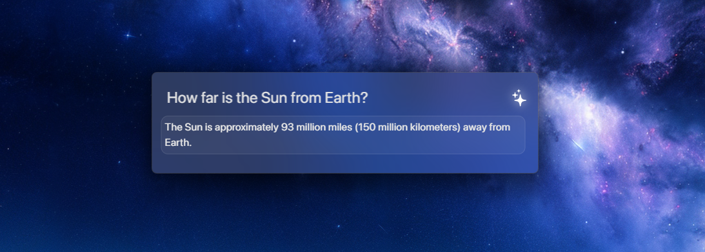

# Hyperbar

Hyperbar is an always-there desktop assistant designed to simplify your interactions with your computer. It provides a sleek and minimalistic interface that you can summon at any time with a simple keyboard shortcut.

*This project is for me to learn JavaScript, I'm still in High School, so take this into consideration*

## [What's new?](./changelogs/0.2.7.md) - [Previous Change Log](./changelogs/0.2.6.md)

## Features

- **On-demand Access**: Use the `CTRL+ALT+K` shortcut to bring up Hyperbar whenever you need it.
- **Seamless Integration**: Hyperbar sits quietly in your system tray, ready to assist without intruding on your workspace.
- **Customizable**: Open the settings pane to tailor Hyperbar to your preferences.

### Shortcuts
`CTRL+ALT+K` *or* `⌘+ALT+K` **-** **Open Hyperbar**
 
`CTRL+S` *or* `⌘+S`  **-** **Open Settings**, *while Hyperbar is open*
 
`ESC` **-** **Close Hyperbar**, *while tabbed in app*
 
`CTRL+Q` *or* `⌘+Q` **-** **End / Quit Hyperbar**, *while tabbed in app*

## Getting Started

These instructions will get you a copy of Hyperbar up and running on your local machine for development and testing purposes.

### Prerequisites

What things you need to install the software and how to install them:
 
**Work in Progress**

End with an example of getting some data out of the system or using it for a little demo.

## Contributing

Please read contact me at **@nitves** on **Discord** for details and process for submitting pull requests to us.

## License

This project is licensed under the GPL-3.0 License - see the [License](LICENSE) for details.

## Acknowledgments

- OpenAI

